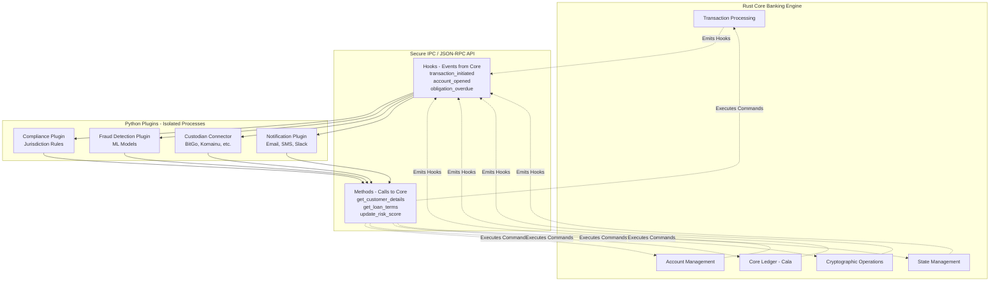

# RFC: A Proposal for a Plugin Architecture in Lana Bank

## 1. Executive Summary

This document proposes a potential architectural evolution for the Lana Bank system: the adoption of a **plugin architecture**. The core idea is to maintain the existing high-performance Rust engine for core ledger and transaction processing while externalizing business logic, compliance rules, and third-party integrations into isolated, independently deployable plugins.

This pattern could offer a robust solution to a primary strategic challenge we may face as we scale: supporting multiple jurisdictions. As we expand, we will likely need to support different KYC providers, integrate with various custodians, and adhere to diverse regulatory reporting standards. Managing this complexity by hard-coding jurisdiction-specific logic into the core Rust application could risk creating brittle technical debt that becomes difficult to unwind over time.

A plugin architecture could mitigate this risk by allowing us to encapsulate the logic for each jurisdiction, KYC provider, or reporting standard into a self-contained plugin. This would help keep the core engine clean and stable, enabling us to adapt to new market requirements with greater agility and security.

## 2. Precedent & Inspiration: The Core Lightning Model

This proposal finds a strong precedent in the robust, battle-tested plugin architecture pioneered by Core Lightning (CLN), a leading implementation of the Bitcoin Lightning Network. CLN's success demonstrates that a high-performance core can be safely and powerfully extended by a vibrant ecosystem of plugins written in various languages.

This model allows for rapid innovation and customization while maintaining the extreme stability required for financial network software. Their successful approach offers a valuable model we could learn from.

**Key Resources:**
-   **Plugin System Overview:** [https://docs.corelightning.org/docs/plugins](https://docs.corelightning.org/docs/plugins)
-   **Plugin Development Guide:** [https://docs.corelightning.org/docs/plugin-development](https://docs.corelightning.org/docs/plugin-development)
-   **Community Plugin Repository:** [https://github.com/lightningd/plugins](https://github.com/lightningd/plugins)

## 3. Potential Strategic Advantages

Adopting this model could provide several transformative advantages, enhancing our platform in key areas:

**1. Enhanced Security and Risk Isolation:**
-   **Fault Isolation:** A bug in a non-critical plugin (e.g., a reporting script) would be isolated from the core ledger. The Rust engine would remain protected, helping ensure the highest level of stability for core financial operations.
-   **Simplified Audits:** Auditing El Salvador's compliance rules could become a review of a self-contained `el_salvador_plugin.py` script, instead of a deep dive into interconnected Rust modules.
-   **Containment of Third-Party Risk:** The risk associated with a third-party API (like a custodian or KYC provider) could be contained within its specific plugin, preventing an outage from cascading into the core system.

**2. Improved Development Velocity and Flexibility:**
-   **Parallel Development:** This model could enable different teams to work in parallel. A data science team could build a fraud detection model in Python while the core team optimizes the ledger, without blocking each other.
-   **Lower Onboarding Cost:** A new developer wouldn't necessarily need to be a Rust and event-sourcing expert to implement a business rule. They might only need to know Python and a simple, well-documented API.
-   **Right Tool for the Job:** This approach would allow us to use Rust for its strengths (safety, performance) and Python for its strengths (rapid development, data science libraries, scripting).

**3. A More Adaptable and Future-Proof Platform:**
-   **Simplifying Complex Systems:** This architecture provides a clear path to potentially re-architecting the dbt reporting pipeline. Regulatory logic could move into a testable Python plugin that fetches data via a stable API, reducing a source of maintenance overhead.
-   **Adaptability to Market Changes:** When a new custodian needs to be added or a new notification channel is requested, it could be a matter of deploying a new plugin, leaving the core of the bank stable and untouched.

## 4. The Proposed Architecture

The system would be divided into two primary components: the **Core Engine** and **Plugins**, communicating via a secure JSON-RPC interface.



-   **The Core Engine (Rust)**: Remains the authoritative source of truth. Its responsibilities are focused on performance-critical operations: managing the ledger, ensuring data integrity, and executing the fundamental state changes of the system.
-   **Plugins (Python, etc.)**: Consume notifications (hooks) from the core and use a well-defined API (methods) to query data or command the core to perform actions. They would contain the business logic.

## 5. How This Pattern Could Address Specific Scenarios

This architecture could help address challenges in a few key areas:

1.  **Jurisdiction-Specific Logic:**
    -   *Current Approach*: Business logic for different jurisdictions is often handled within the core application.
    -   *Proposed Approach*: This logic could be moved into simple, auditable scripts. A change to a country's compliance rules would mean updating a specific plugin, not the core Rust code.

2.  **Data & Reporting Pipeline:**
    -   *Current Approach*: The Meltano/dbt pipeline for reporting is powerful but tightly coupled to the database schema.
    -   *Proposed Approach*: As a long-term goal, the reporting pipeline could be supplemented or replaced by plugins that subscribe to hooks, fetch data from the core via a stable RPC API, and generate reports.

3.  **External Service Integrations:**
    -   *Current Approach*: Adding a new custodian requires modifying the core application.
    -   *Proposed Approach*: Custodians could become "connector" plugins. Adding a new provider would involve deploying a new plugin, leaving the core engine untouched.

4.  **Developer Experience & Onboarding:**
    -   *Current Approach*: To implement many features, a developer must understand Rust and the core system's event-sourcing model.
    -   *Proposed Approach*: A developer working on a fraud rule, for example, might only need to know Python and the plugin API, potentially lowering the barrier to contribution.

## 6. Expanded Plugin Examples

To illustrate the power of this model, here are more concrete examples:

### Example 1: Multi-Channel Notification Plugin

Currently, our notification system is implemented as a hard-coded job listener (`EmailEventListenerRunner`) that is tightly coupled to specific events like `ObligationOverdue` and a single channel (email). To add a new notification for a different event, or to send a message via SMS or Slack, would require modifying and redeploying the core Rust application.

A plugin replaces this rigid structure with a flexible, configurable system. It listens for a business event and can orchestrate notifications across any channel, with logic that can be updated independently of the core engine.

```python
# notification_plugin.py
@plugin.hook("obligation_overdue")
def on_obligation_overdue(plugin, obligation, **kwargs):
    """
    Handles an overdue obligation by notifying the customer via email and
    alerting the internal team via Slack. This plugin could easily be
    extended to send an SMS via another RPC call (e.g., plugin.rpc.send_sms).
    """
    customer = plugin.rpc.get_customer_details(obligation['customer_id'])
    
    # 1. Send a formal email to the customer
    email_subject = f"Your Loan Payment for facility {obligation['facility_id']} is Overdue"
    email_body = f"Dear {customer['name']}, your payment of ${obligation['amount']} is now overdue."
    plugin.rpc.send_email(
        recipient=customer['email'], 
        subject=email_subject,
        body=email_body
    )

    # 2. Send an urgent Slack alert to the internal team
    slack_message = (
        f":warning: *Obligation Overdue*:\n"
        f"> Customer: `{customer['name']}` ({customer['id']})\n"
        f"> Amount: `${obligation['amount']}`\n"
        f"> Days Overdue: `{obligation['days_overdue']}`"
    )
    plugin.rpc.send_slack_message(channel="#collections-alerts", message=slack_message)

    return {"result": "continue"}
```

### Example 2: Custodian Connector Plugin

This plugin abstracts the specifics of a third-party API, presenting a clean, standardized interface to the core engine.

```python
# bitgo_connector_plugin.py
from bitgo_sdk import BitGoSDK

@plugin.init()
def initialize(plugin, configuration, **kwargs):
    """
    Initializes the BitGo SDK with credentials securely
    provided by the core engine at startup.
    """
    plugin.sdk = BitGoSDK(
        api_key=configuration.get('api_key'),
        api_secret=configuration.get('api_secret')
    )
    plugin.log("BitGo connector initialized successfully.")

@plugin.method("generate_custody_address")
def generate_address(plugin, label):
    """
    Generates a new deposit address using the BitGo API.
    The plugin transforms the raw SDK response into a clean,
    standardized format for the core engine.
    """
    response = plugin.sdk.wallets.generate(label=label)
    
    if not response.is_success():
        raise Exception(f"BitGo API Error: {response.error_message}")
    
    # Return a standardized dictionary, not the raw SDK object
    return {
        "external_id": response.data['id'],
        "address": response.data['receiveAddress']['address'],
        "raw_response": response.json() # For audit purposes
    }
```

### Example 3: Regulatory Reporting Plugin (dbt Replacement)

This plugin replaces a fragile dbt model by fetching data on-demand and applying logic in Python.

```python
# reporting_plugin.py
@plugin.method("generate_report")
def generate_ssf_report(plugin, report_type, for_date):
    """
    Generates a regulatory report for El Salvador (SSF).
    This replaces the complex `int_nrp_41_02_referencia.sql` model.
    """
    if report_type != "NRP-41-02":
        raise ValueError("Report type not supported")

    plugin.log(f"Generating NRP-41-02 report for {for_date}")
    
    # 1. Fetch live data from the core engine via RPC
    loans = plugin.rpc.get_active_loans(date=for_date)
    customers = plugin.rpc.get_customers_by_id([loan['customer_id'] for loan in loans])

    # 2. Apply complex regulatory logic in clear, testable Python code
    report_entries = []
    for loan in loans:
        customer = customers.get(loan['customer_id'])
        if not customer:
            continue
        
        entry = {
            "nit_deudor": customer['tax_id'],
            "num_referencia": loan['id'],
            "monto_referencia": loan['original_amount_usd'],
            "saldo_referencia": loan['current_balance_usd'],
            "estado_credito": 'A' if loan['is_active'] else 'C',
            # ... dozens more fields calculated here using Python functions
        }
        report_entries.append(entry)

    # 3. Return the structured data for the core to save
    return {"report_name": f"NRP-41-02-{for_date}", "data": report_entries}
```

## 7. A Possible Implementation Plan

This architecture could be adopted incrementally, starting with a pilot project to demonstrate its value.

1.  **Phase 1: Build the Foundation**
    *   Create a Rust crate (`lana-plugin-host`) to manage plugin subprocesses and the JSON-RPC communication layer.
    *   Define an initial API contract (a few key hooks and methods) in a shared `lana-plugin-api` crate.
    *   Implement security sandboxing: process isolation, resource limits (memory/CPU), and request timeouts.

2.  **Phase 2: Pilot Project - The Reporting Plugin**
    *   The El Salvador regulatory reporting seems like an ideal first candidate.
    *   **Action**: Create the `reporting_plugin.py` as detailed above. This plugin would implement logic currently in the dbt models. It could be called by a simple job in the core, providing immediate value by simplifying a complex part of the system.

3.  **Phase 3: Incremental Migration**
    *   If the pilot is successful, we could then consider migrating external integrations like Sumsub webhooks and Custodian API calls into dedicated connector plugins.
    *   Further down the line, we might also look at moving complex business workflows, like notification sequences, into plugins.

## 8. Conclusion & Invitation for Discussion

The plugin architecture offers a potential path to evolve Lana Bank, building on the strength and security of the Rust core while empowering more rapid and flexible development of the business logic that defines our product.

This approach could lead to a more resilient, scalable, and future-proof system; discussion, feedback, and ideas are welcome. 